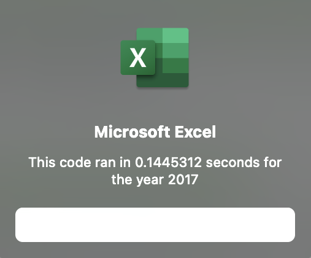

# Refactoring VBA Code

## Project Overview
### Background
A client initially asked for help analyzing the performance of a limited set of stock data. They wanted to quickly find the total volume traded per year as well as determine annual growth rates for certain stocks. They were pleased with the product and returned to request a VBA macro that would be capable of performing the same task on a larger set of data with greater speed and efficiency.

### Purpose
In order to fulfill the client’s request we refactored the earlier code to run more quickly. Instead of using nested for loops and looping multiple times through the database rows, we were able to rewrite the code in such a way that only one loop through the rows was necessary. By streamlining the code and directing it to execute operations specific to each row’s ticker, we were able to dramatically improve runtimes, providing the client with a sleeker macro much more capable of analyzing large amounts of stock data.

## Results
### Method
The client provided us with two years of data on daily stock prices and trading volumes for twelve different tickers and requested that we find the change in price as well as the total volume traded for each ticker in 2017 and 2018. 

To refactor our code we first initialized an array to hold the stock ticker names, then created three more arrays to hold the outputted starting prices, ending prices, and volumes. We also created a variable ‘tickerIndex’ to ensure that the outputs corresponded to the correct ticker.

We then created a `for` loop to iterate through each row, stopping at the final row. We needed to determine the number of populated rows in the dataset, and we found that the script ‘RowCount = Cells(Rows.Count, “A”).End(xlUp).Row’ would find the correct count of rows.

For each row we increased that ticker’s total volume using the script ‘tickerVolumes(tickerIndex) = tickerVolumes(tickerIndex) + Cells(i, 8).Value’. Then we checked if that was the first or last row associated with its ticker. We wrote an ‘if then’ statement to determine whether the row’s ticker had changed from the previous row (in other words, if it was the first instance of that ticker in the dataset). If it had, we set that day’s price as the ticker’s starting price. If, however, that row’s ticker was different from the following row (if it was the last instance of that ticker in the dataset), we set that day’s price as the ticker’s ending price. Lastly, at each ticker’s final row we increased the ‘tickerIndex’ by one to move on to the next ticker on the following row.

This differed from our original code in that it the use of the incremental ‘tickerIndex’ variable enabled us to loop through all the rows only a single time, while our original code, which used nested ‘for’ loops, would have had to loop through twelve times, once for each ticker.
	
Finally, we set a timer to record the amount of time our code required to loop through all of the rows and reported the results in a message box. We also printed and formatted the total volumes traded and the percentage change in stock price for each ticker in the “All Stocks Analysis” worksheet.
	

		
### Outcome
Our analysis showed that most of these stocks performed much better in 2017 than 2018. In fact, the only two stocks which showed positive returns both years were “ENPH” and “RUN”. Total volumes traded were similar year-over-year, but many of the stocks which enjoyed positive returns in 2017 fell dramatically in 2018. The following table demonstrates the broadly positive returns for stocks in 2017, which have been shaded green. Some, like “DQ”, saw nearly 200% returns. Only one stock registered negative returns.

By comparison, the table below demonstrates how poorly most of these stocks performed in 2018. All but two are shaded red, indicating that they suffered negative returns. Some saw their 2017 gains completely wiped out.

To more accurately gauge the quality of a stock, one would need to compare its performance to that of other stocks outside the scope of this project. For instance, 2018 may have been a bad year for stocks across the board, and not just these twelve. One would also need to analyze this data across a longer period of time to show broader trends. For instance, “DQ” performed best in 2017, but lost all of that and more in 2018. Others, like “RUN”, only had slim gains in 2017, but came out ahead in 2018.

Our efforts to refactor our code were a clear success. Our original code processed the data for 2017 and 2018 in times of 1.43 and 1.36 seconds, respectively. 

Our refactored code processed the same data in 0.14 seconds for both years.

 

Our original code took about ten times as long to process the data. Clearly the refactored code is faster and more efficient.

## Summary

### Advantages/Disadvantages of Refactoring Code
Refactoring code helps in the performance and debugging of code. As we have seen in this project, refactoring dramatically reduced the time it took to run our analysis. It can also make the code simpler and easier to read and understand. This aids us in debugging code because we are able to more quickly skim the code to find problems. 

The downside of refactoring is that it takes time, and it is possible to accidentally break the code in the process, forcing one to spend even more time getting it right.

### How this applies to refactoring the original VBA script
This applies to our VBA refactoring in two ways. First, refactoring benefited us in that it improved the speed with which our code completes its calculations. We saw our runtimes drop  around 90% after refactoring. This long term advantage in speed may be well worth the initial time investment we made rewriting the code.

On the other hand, we may have introduced problems into the code that will arise later on when it is applied to a different dataset. Our code worked properly because all the rows in our small dataset were well-ordered. Each set of tickers was grouped together and in the order they appeared in our pre-defined array. If our dataset were somehow scrambled, then our refactored code would not process the total volumes correctly. The tickerIndex would get thrown off and then the total volumes would not be fully counted, or would be assigned to the wrong tickers. The original code, with its nested loops, would not have this issue. (Both codes would still have the same problems calculating starting and ending prices if the data rows were moved out of chronological order. We would need to find these prices using an entirely different method if we want to foolproof our code.)
